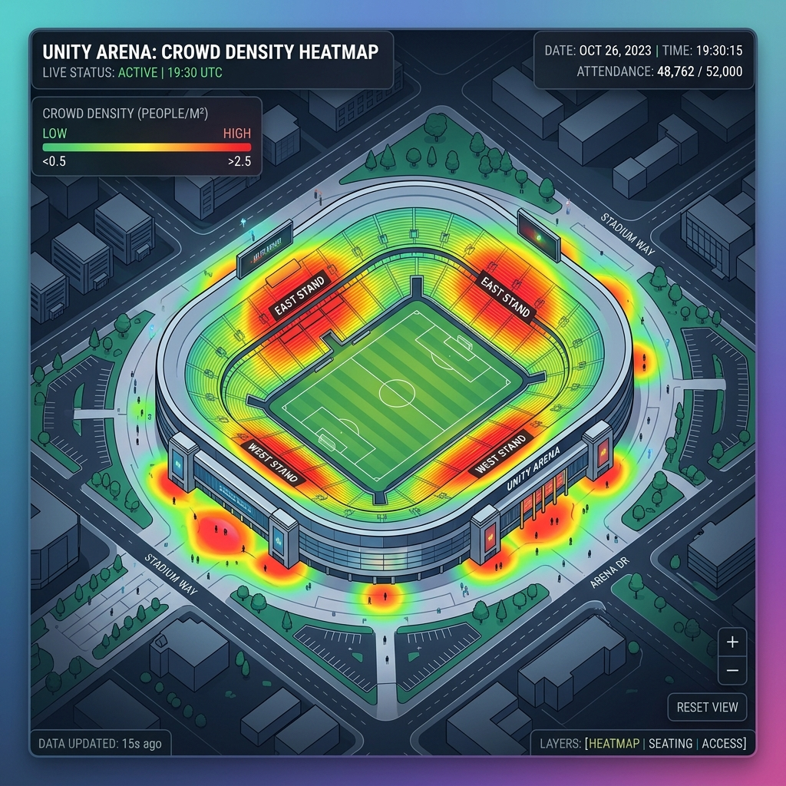
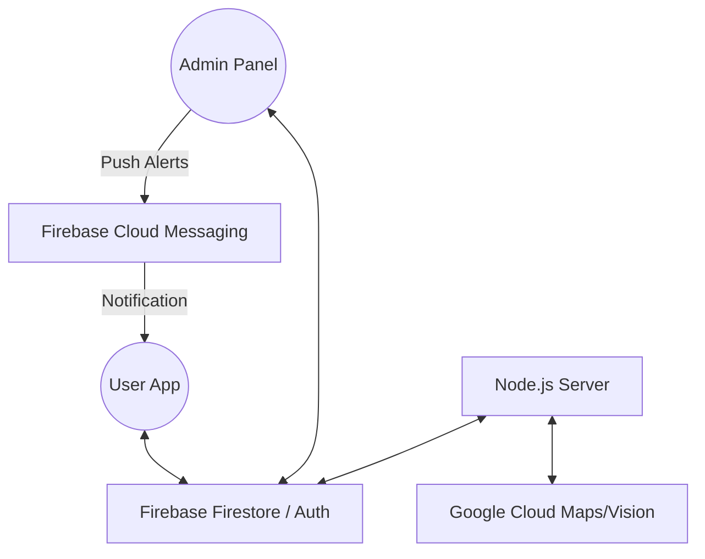

# 🛡️ VenueShield AI Crisis Response

**Elevating the Stadium Experience with Real-Time Intelligence.**


## 🌟 Overview

**VenueShield AI Crisis Response (VSAI)** is a premium, mobile-first companion application designed to transform the live event experience. By integrating real-time data from Firebase and Google Cloud services, VSAI empowers fans to navigate complex stadiums with ease, avoid long queues, and stay safe through instant emergency coordination.

For venue operators, VenueShield provides a powerful **Admin Dashboard** to monitor crowd density, manage events, and respond to assistance requests in real-time, ensuring a seamless and secure environment for thousands of attendees.

---

## 🚀 Key Features

### 🧠 Gemini Crowd Crush Predictor [NEW]

**The heart of VenueShield safety.** This feature uses **Google Gemini 1.5 Flash** to analyze real-time venue telemetry (zone density, entry rates, weather, and event type) to predict potential stampedes or crowd crushes **15 minutes before they happen**. 

- **Preventive Analysis**: Moves security from "Reactive" to "Proactive".
- **Actionable Commands**: Provides stewards with specific diversion tactics (e.g., "Close Gate C, Divert to North").
- **Auto-Emergency Broadcast**: Instantly triggers a venue-wide notification if a critical risk threshold is reached.

### 🗺️ Real-Time Crowd Heatmaps

Visualize stadium congestion levels instantly. Our integration with Google Maps API (Visualization Library) provides live heatmaps, allowing users to identify crowded zones and find quieter routes or facilities.


### ⏳ Smart Queue Management

Stop guessing wait times. VenueShield tracks and predicts queue lengths for restrooms, concessions, and entry points, helping fans spend more time enjoying the event and less time standing in line.

### 📍 Indoor Navigation & Location Sharing

Lost in a sea of sections? Our indoor locator helps you find your way. Plus, users can share their real-time location with stadium staff or friends in case of emergencies, ensuring help is always just a tap away.

### 🎫 Integrated Event & Ticket Management

Browse upcoming events, request digital tickets, and sync them to your calendar. The system handles multi-ticket permissions and automated fee notifications seamlessly.

### 🛠️ Professional Admin Dashboard

A centralized hub for venue managers to:

- **Deploy Alerts**: Send emergency FCM notifications to all users.
- **Manage Heatmaps**: Update congestion data dynamically.
- **Coordinate Assistance**: Real-time tracking of staff response to user help requests.
- **Event Orchestration**: Create, edit, and monitor live events.

---

## 🛠️ Technology Stack

| Layer              | Technology                                                         |
| :----------------- | :----------------------------------------------------------------- |
| **Frontend**       | Vanilla JavaScript (ES6+), HTML5, CSS3 (Modern Token-based System) |
| **Backend**        | Node.js, Express.js                                                |
| **Database**       | Firebase Firestore (Real-time NoSQL)                               |
| **Authentication** | Firebase Auth                                                      |
| **Cloud Services** | Google Maps Platform, Firebase Cloud Messaging (FCM), Google Gemini AI (1.5 Flash) |
| **Deployment**     | Dockerized for seamless scaling                                    |

---

## 🏗️ Architecture



---

## ⚙️ Setup & Installation

### Prerequisites

- Node.js (v16+)
- Firebase Project with Firestore and Auth enabled
- Google Cloud API Key (with Maps & Visualization libraries)

### 1. Clone & Install

```bash
git clone https://github.com/gayatridot/VenueShield-AI-Crisis-Response.git
cd VenueShield-AI-Crisis-Response
npm install
```

### 2. Configure Environment

Create a `.env` file in the root directory:

```env
PORT=3000
FIREBASE_API_KEY=your_key
FIREBASE_AUTH_DOMAIN=your_project.firebaseapp.com
FIREBASE_PROJECT_ID=your_project_id
GOOGLE_MAPS_API_KEY=your_google_maps_key
```

### 3. Run Locally

```bash
npm run dev
```

Open `http://localhost:3000` to view the app. Access the admin panel at `http://localhost:3000/admin.html`.

---

## 🛡️ Safety & Privacy

User location sharing is **strictly opt-in** and only active during live assistance requests. Data is handled according to modern security standards using Firebase Security Rules.

---

## 📄 License

This project is licensed under the MIT License - see the [LICENSE](LICENSE) file for details.

Developed with ❤️ for the Hackathon.
